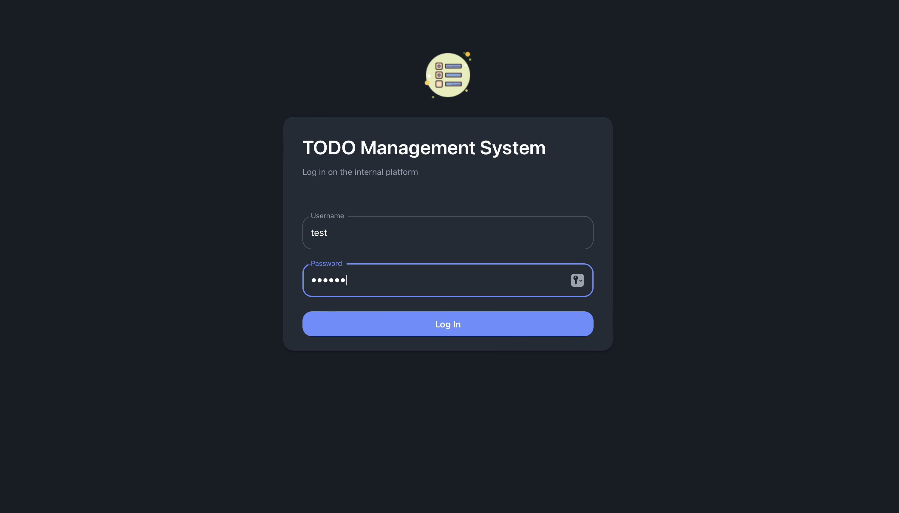
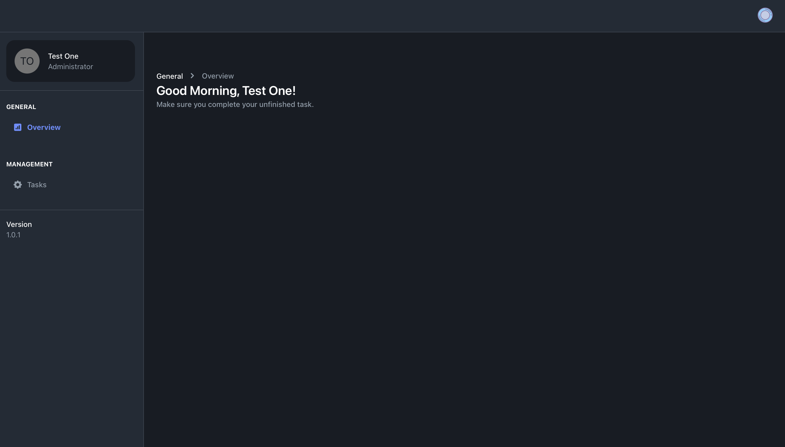
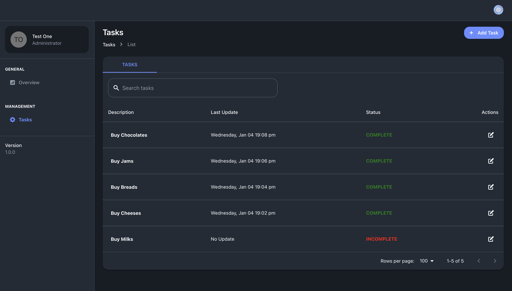
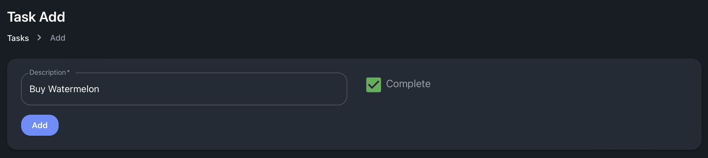
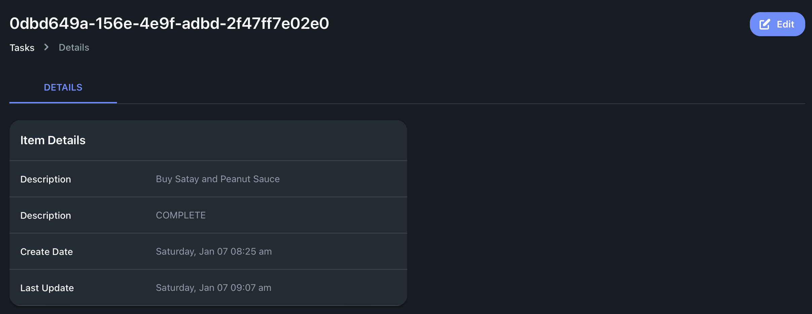
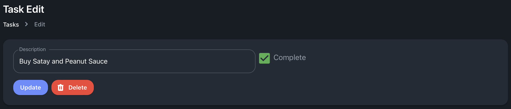

# TODO Web Application

> Simple online TODO API with user authentication.

## WAR File
Please run below command to generate the WAR file in target folder, after downloaded the source code.
Alternatively, readers can download from this [link](https://1drv.ms/u/s!ApLlb52SrD-qhv4vcaXWZ5MW6f8yYg?e=aK6eig).

```sh
$ mvn clean package
```

## Approach
The author is aware of the TODO application's simplicity and that it can be made using a simple monolithic approach.
However, the authors choose a distributed approach because the authors believe this application is only a practice application. 
The types of applications in the actual project will be far more huge and complex. 
Therefore, the microservice architecture is a good solution for complex distributed project. 
This architecture has a high level of modularity, fault tolerance, scalability, and testability.
The author uses **spring boot** technology for the back end API and **react** as the web client front end.

## Architecture


System components consist of a microfrontend, a microservice, and a database. It may seem simple, but this approach opens up the possibility of developing an architecture.
The architecture design follows an aggregator pattern, which splits large complex problems into independent services.


User authentication and todo modules, for example, can be separated into separate microservices.
In this way, the system scale can be quickly increased or decreased based on needs.
It is also possible to add an API Gateway, which acts as authentication, network routing and load balancer, if there are a lot of users.

## Code Structure and Clarity


The code structure is divided into 2 parts, actual and test source.
There are 4 main modules, authentication, core, task, and user.


The code is separated by several folders. The structure in it follows the MVC design, but without View.
1. **Controller.** This folder controls REST API resource path.
2. **Entity.** This folder defines data model for database entity.
3. **Model.** This folder consists of data model for request and response, including enum and constant.
4. **Repository.** This folder keeps an interface to query to database.
5. **Service.** Service file is the primary logic for controller.


In the test folder section, there is a section for unit tests. 
Unit tests are written for the repository interface and service layer.

**Note for clarity:**
1. Use builder design pattern for object creation. 
2. Maximise Java8 lambda feature in writing code.
3. Enum for easier code maintenance.
4. Use flyway to organizing database script and versioning.

## Performance
The author embeds the **pagination** feature when loading tasks, so that the performance of the client application remains stable.
Spring Boot's built-in features such as **dependency injection** and **lazy loading** also improve application performance.

## Security

### API Security
Spring security and JWT are used by the author to implement API security.
The authorization token can only be obtained after the user logs in.
Whenever user call another API, this token is sent as part of the request header.


The security workflow of the TODO API is depicted in the image above.
The user request will first go through the JWTFilter to see if a token exist in the header.
If there is, JWTService will verify the token's validity.
If it is invalid, the user will receive a 403 Forbidden HTTP status.
If the credentials are legitimate, JWTFilter will check them against the database.
When all of these conditions are met, 
JWTService will update the Spring Security Context Holder, 
and the controller will provide an HTTP status code of 200 to the user.

### Validations
A check is conducted on both the client and the server side to ensure that field requests are correct. 
The **Formik** node library can be used to check the input form entered by the user on the client side. 
As for server side validation, it utilizes the **Hibernate Validator** to validate the fields in the API request.

## Testing

> **Important credentials:** 
> 1. username: test, password: pwd123
> 2. username: test2, password: pwd124

### Back End Testing
The author uses postman to test the back end without a client. 
Readers can export [todo.postman_collection.json](postman/todo.postman_collection.json) to the local environment. 
Readers can also create their client web apps to interact with the TODO API provided in this project. 
In addition, full API documentation can be found in this [link](https://documenter.getpostman.com/view/3482922/2s8Z73zWXF).

**Note:** 
Make when run the API, call the auth API first to get JWT token. 
This token need to put in header as authentication call other services.

### Front End Testing
It should be noted that the client web service used is a **recycling** of the **previous author's project**.
The use of this web client is only for demonstration of using the TODO API. 
Don't forget to turn on the back end server first before running the web client.

1. Download the front end source code, and install the node modules using below command:

   ```sh
   $ npm install --legacy-peer-deps
   ```
   
2. Run the client application.

   ```sh
   $ npm run start
   ```

3. Go to `localhost:3000` to see the homepage.

   

4. Go to `localhost:3000/dashboard`, put correct credentials.

    

5. After login, user will be arrived at dashboard page.

   

6. Click task, it will show user's TODO list.

   

7. User can add task by clicking Add Task button on top left.

   

8. User can see detail of the TODO by clicking description hyperlink.

   

9. User can Update and Delete TODO by clicking edit button in task list or in detail page.

   

## Authors
- **Cornelius** - _Initial work_ - [cornelius-tyranade](https://github.com/cornelius-tyranade) - tyranadeisn1@gmail.com
