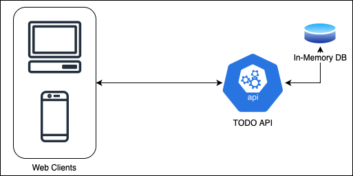
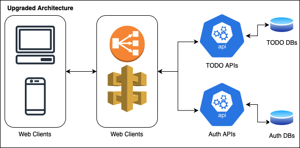
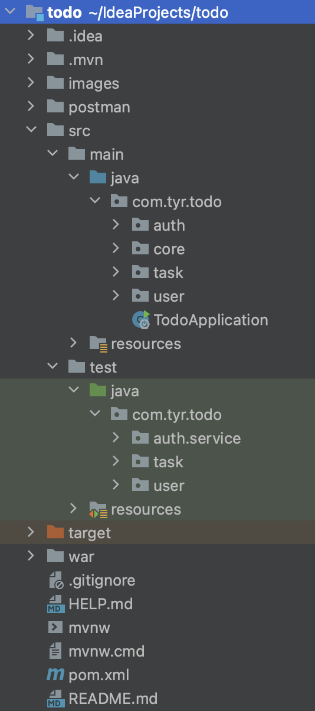
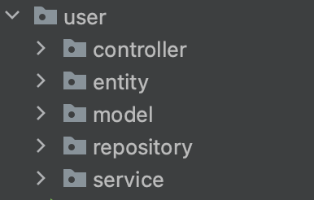
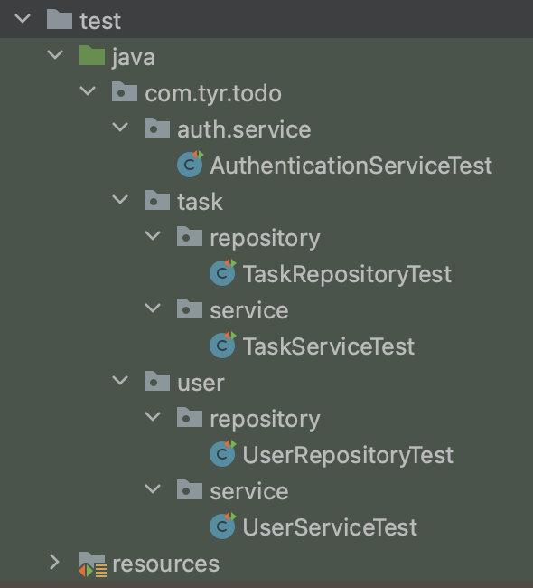
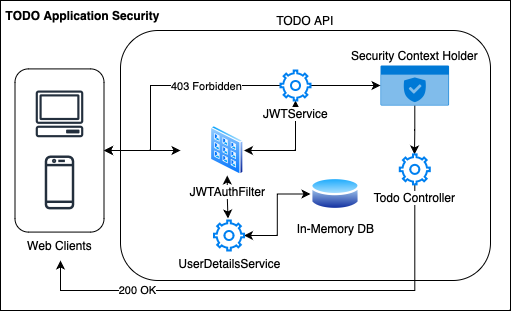

# TODO Web Application

> Simple online TODO API with user authentication.

## Approach
This author is aware of the TODO application's simplicity and that it can be made using a simple monolithic approach.
However, the authors choose a distributed approach because the authors believe this application is only a sample application, 
so the types of applications in the actual project will be far more complex. 
Therefore the microservices architecture is a good solution for big and complex project. 
This architecture has a high level of modularity, fault tolerance, scalability, and testability.
The author uses **spring boot** technology as the back end API and **react** as the front end.

## Architecture

The current system is separated into 3 main parts using the microservices approach: 
microfrontend, microservice, and database. 
The picture above may look simple, 
but the potential for developing an architecture will be more accessible by using this approach.
This architecture design follows an aggregator pattern that splits large complex problems into independent services.

For example, developers can separate the authentication and todo modules into individual microservices. 
That way, the System Scale can quickly increase or decrease according to needs. 
The system can also be added with an API Gateway which functions as a reverse proxy and a load balancer 
if there are a lot of application users.

## Code Structure and Clarity

The code structure is divided into 2 parts, actual and test source.
There are 4 main modules, authentication, core, task, and user.

The code is separated by several folders. The structure in it follows the MVC design, but without View.
1. **Controller.** This layer is to determine API resource path.
2. **Entity.** This layer is data model for database entity.
3. **Model.** This layer is data model for request and response, including enum and constant.
4. **Repository.** This layer is interface to query to database.
5. **Service.** This is the primary logic for controller.

The unit test section is in the test folder section. 
The author makes unit tests for the repository interface and service layer.

**Note for clarity:**
1. Use Builder design pattern for Object creation. 
2. Maximise Java8 lambda feature in writing code.
3. Enum for easier code maintenance.
4. Use flyway to database script versioning.

## Performance
The author embeds the pagination feature when loading tasks, so that the performance of the client application remains stable.
Spring Boot's built-in features such as dependency injection and lazy loading also improve application performance.

## Security
The author implements API security using Spring security and JWT. 
The user must log in first to get the authorization token. 
This token is placed in the request header when calling other APIs.

The picture above is the security workflow in the TODO API. 
The user request will pass through the JWTFilter first to detect whether a token is attached to the header. 
If there is, it will be followed by checking the token's validity by JWTService. 
If it is not valid, it will be given a 403 Forbidden HTTP status to the user. 
If valid, JWTFilter will check the credentials on the database. 
When all are valid, JWTService will update the Spring Security Context Holder, 
and then the controller will give HTTP status response of 200 to the user.

## Testing
The author uses postman to test the back end without a client. 
Readers can export [todo.postman_collection.json](postman/todo.postman_collection.json) to the local environment. 
Readers can also create their client web apps to interact with the TODO API provided in this project. 
In addition, full API documentation can be found in this [link](https://documenter.getpostman.com/view/3482922/2s8Z73zWXF).

**Note:** 
Make when run the API, call the auth API first to get JWT token. 
This token need to put in header as authentication call other services.

> Credentials: username: test, password: pwd123

## Authors
- **Cornelius** - _Initial work_ - [cornelius-tyranade](https://github.com/cornelius-tyranade) - cornelius.works@gmail.com
